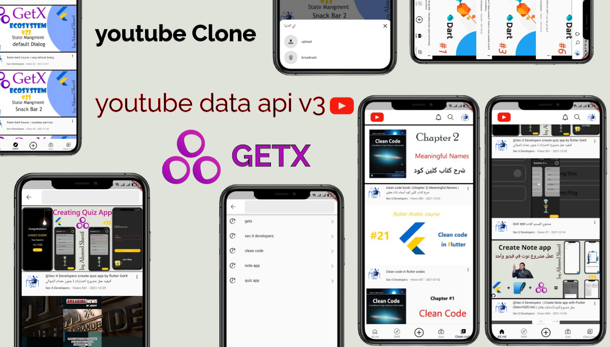
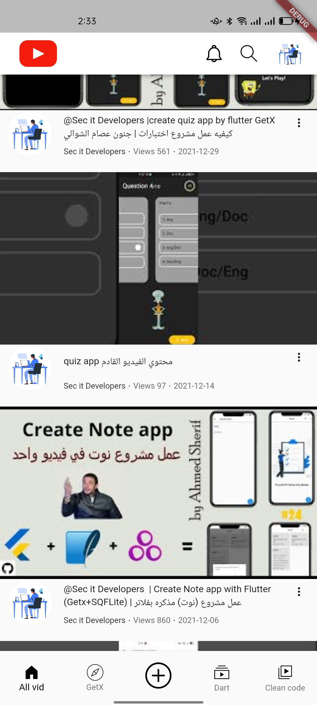
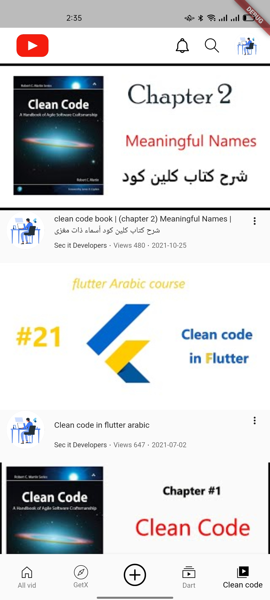
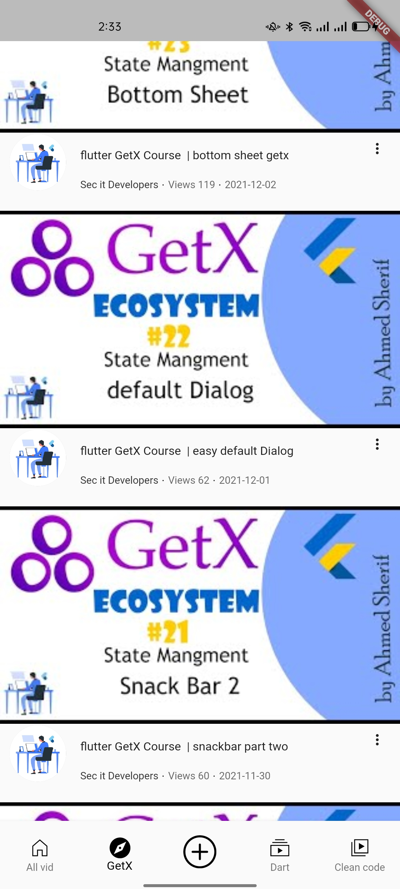
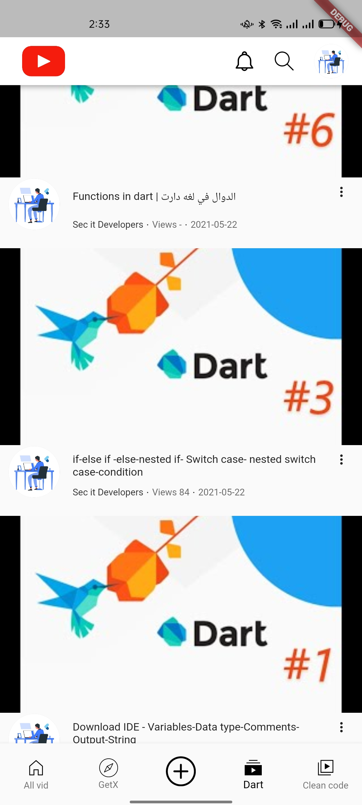
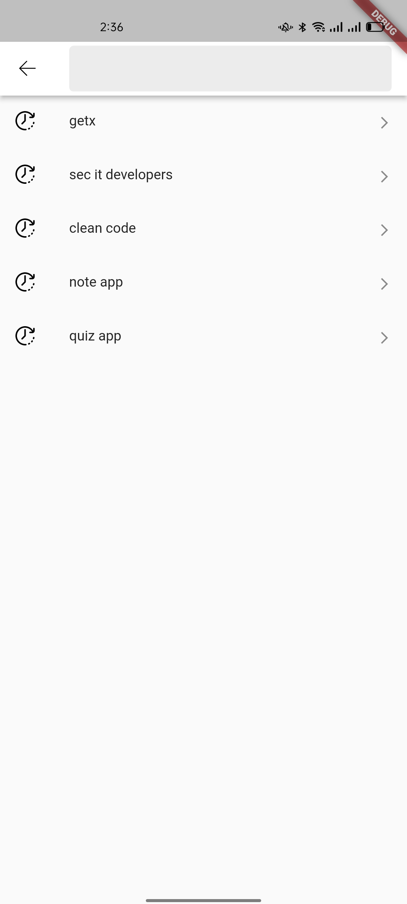
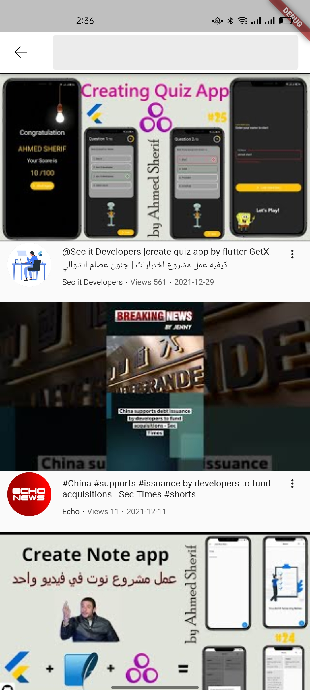
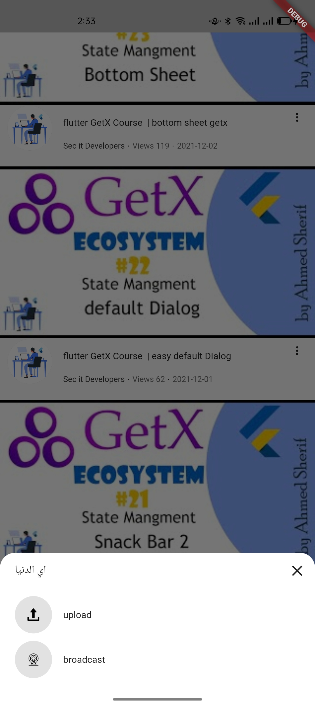

# Youtube App ✍🏻
Youtube App Clone with GetX & Youtube Data Api V3 [MVC pattern] 👨🏻‍💻

Youtube App app is open-source Youtube App app for Android & ios. It is built with Dart on top of Google's Flutter Framework.

<b>Youtube App</b>

##:rocket: youtube Tutorial

- Quiz App by GetX Link: [Quiz](https://www.youtube.com/watch?v=CasRDoWlPcY&t=899s&ab_channel=SecitDevelopers)
- Note App by GetX Link: [Note](https://www.youtube.com/watch?v=ZrDK3fG4PO0&t=198s&ab_channel=SecitDevelopers)
- news App Api by GetX Link: [News](https://www.youtube.com/watch?v=MFjoIT3RJSc&list=PLI36SLicSOmKQMPwPauvWDARjzrlQyLIo&index=21&ab_channel=SecitDevelopers)
- Ecommerce App by GetX Link: [MakeUp](https://www.youtube.com/watch?v=-bwiujixOpU&list=PLI36SLicSOmKQMPwPauvWDARjzrlQyLIo&index=3&ab_channel=SecitDevelopers)
- Qr Code: [Qr Code](https://www.youtube.com/watch?v=-QCrf5EytSc&list=PLI36SLicSOmLSQCD1Ccw7gazmeBlcAsAj&ab_channel=SecitDevelopers)
- Voice to Text App: [Voice to Text App](https://www.youtube.com/watch?v=dpdnvSI0Dn8&list=PLI36SLicSOmLSQCD1Ccw7gazmeBlcAsAj&index=2&ab_channel=SecitDevelopers)
- GetX EcoSystem playList Link: [PlayList](https://www.youtube.com/watch?v=8Jy4dtQOZMQ&list=PLI36SLicSOmKQMPwPauvWDARjzrlQyLIo&index=1)

## About🤠

Youtube Clone App By Flutter With GetX EcoSystem And Youtube Data Api V3

## Benfit👻
- [🖥] # Screens 🖥
- [🆗] Home Screen
- [🆗] Search Screen
- [🆗] GetX Video Screen
- [🆗] Dart Video Screen
- [🆗] Clean Code Video Screen
- [🆗] Bottom Sheet Screen
--------------------------------
- [x] [GetX]
- [x] [GetXService]
- [x] [GetXController]
- [x] [GetConnect]

--------------------------------
- [x] MVC patterns
- [x] Create search History.
-------------------------------
- [🖥] # Deal With 🖥
- [x] Deal With YoutubeSearch.
- [x] Deal With dependency injection.
- [x] Deal With Api V3
- [x] Deal With ScrollController
- [x] Deal With Youtube Player Controller
- [x] Deal With VideoController
- [x] Deal With enum
------------------------------
- [🖥] # Fech Data 🖥
- [x] get VideoInfoById
- [x] get YoutuberInfoById
--------------------------
- [🖥] # Video 🖥
- [✅] titleZone
- [✅] descriptionZone
- [✅] Sub buttonZone
- [✅] ownerZone
- [✅] thumbnail

## Snapshots

| Home Page | Clean code Page|
|------|-------|
|||

| GetX Page | Dart Page|
|------|-------|
|||

| Search Page | Screen Search |
|------|-------|
|||

| Bottom Bar
|------
|

## Other Flutter Projects 🔐
- [Quiz App](https://github.com/itsherifAhmed/Quiz-app)
- [News App](https://github.com/itsherifAhmed/NewsApp)
- [Device Detail App](https://github.com/itsherifAhmed/device-detail-app)
- [White board Draw App](https://github.com/itsherifAhmed/draw-app)
- [music app player external storage read](https://github.com/itsherifAhmed/Music-Player-Read-external-Storage-Flutter-app)
- [Make Up App flutter MVC Getx](https://github.com/itsherifAhmed/MakeUp-App)
- [Speech to Text app flutter](https://github.com/itsherifAhmed/Speech-to-text-app)
- [api flutter project](https://github.com/itsherifAhmed/apiFlutter-Project)
- [qr code app](https://github.com/itsherifAhmed/qr-barcode)
- [facebook ui clone](https://github.com/itsherifAhmed/facebook-ui-clone)
- [Login Screen](https://github.com/itsherifAhmed/login-screen)

 
<b>minSdkVersion 19</b>

 
<b>targetSdkVersion 28</b>

 

## Dependencies 💤
 -  `get:`
 -  
 -  `flutter_svg:`
 -  
 -  `youtube_player_flutter:`
 -  
 -  `intl:`
 -  
 -  `shared_preferences:`
 -  
 -  `cached_network_image:`

